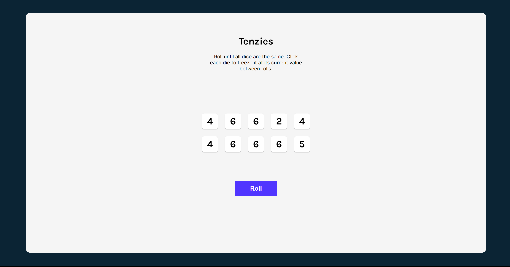
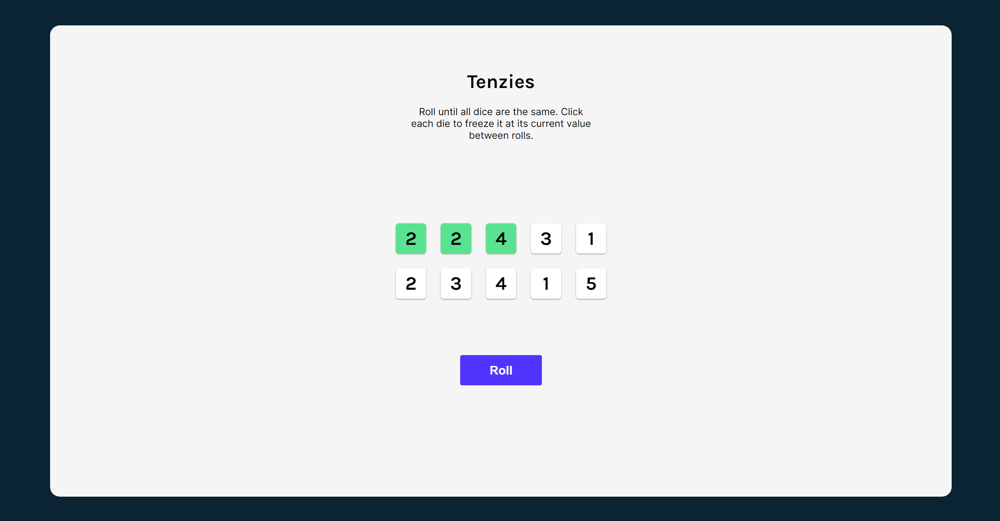
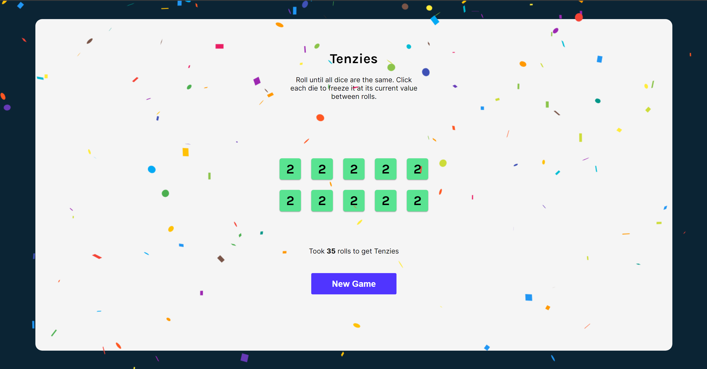

# Tenzies

Tenzies is an interactive web game made using ReactJS.

## Installation

Use the package manager [npm](https://www.npmjs.com/) to Tenzies.

```bash
cd my-project
npm install
npm run build
npm start
```

## Getting started

This app was built with [React](https://react.dev/) and [Vite](https://vitejs.dev/)

## Usage

Click to hold die and roll until all dice have the same value



## Built with

- HTML
- CSS
- ReactJS
- Vite

## Screenshots

Game in progress




Game won



## Links

Github - [https://github.com/bijitregmi/tenzies](https://github.com/bijitregmi/tenzies)<br>
Netlify - [https://tenzies-game-scrimba.netlify.app/](https://tenzies-game-scrimba.netlify.app/)

## Learning process

- React hooks and Side Effects
- States
- Conditional rendering
- Form state management
- Local Storage usage
- Dependency and package management

## Acknowledgment

- [React](https://react.dev/) - Documentation for most implementations 
- [Stack overflow](https://stackoverflow.com/) - Answers for various array functions
- [Srcimba](https://scrimba.com/) - Project idea and learning material